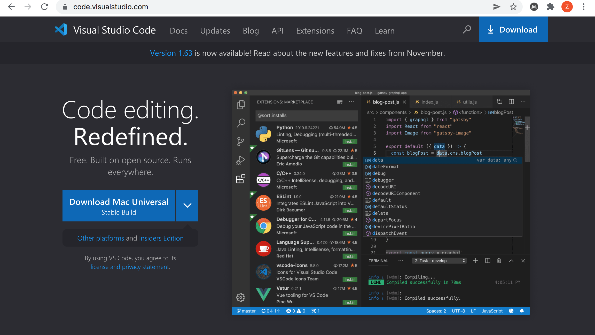
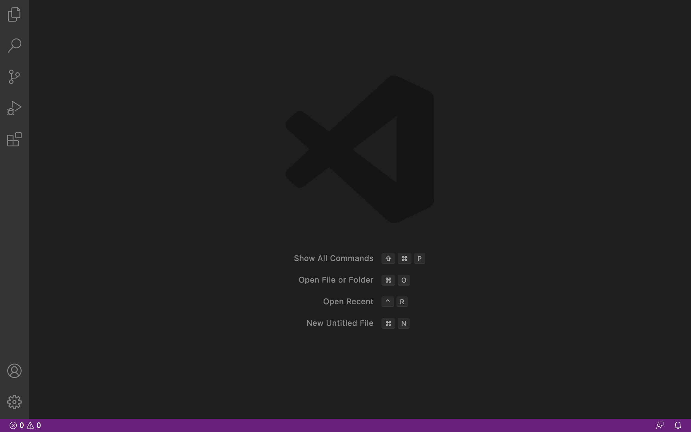
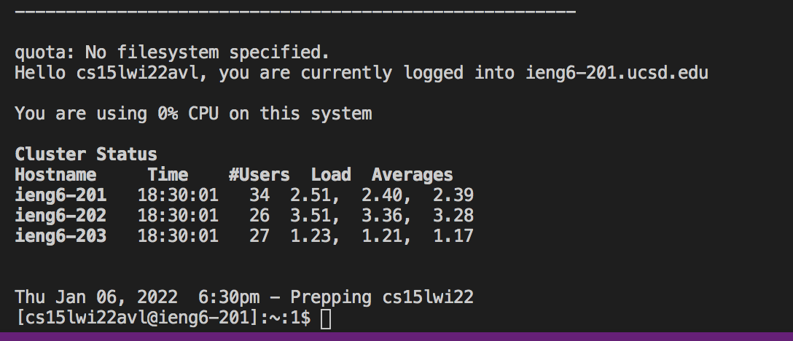
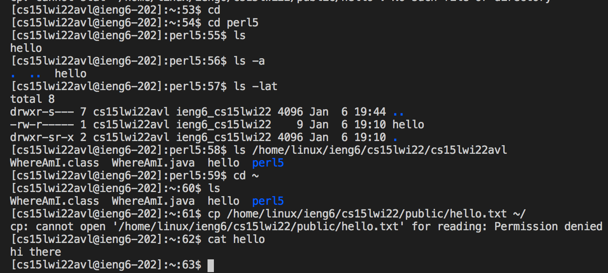
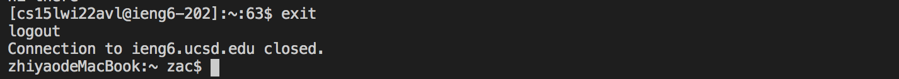
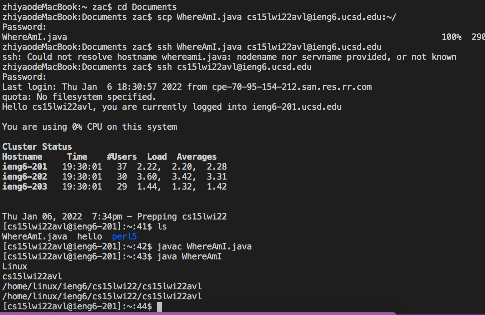
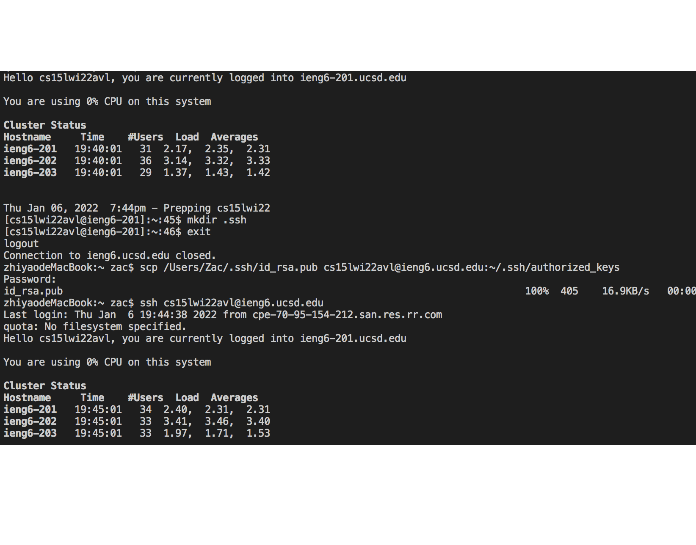
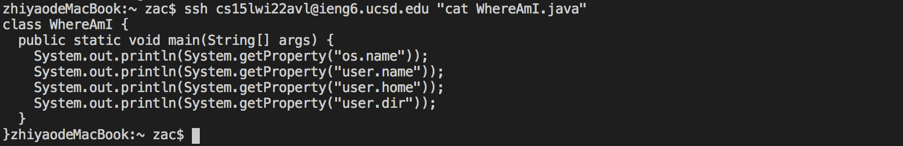
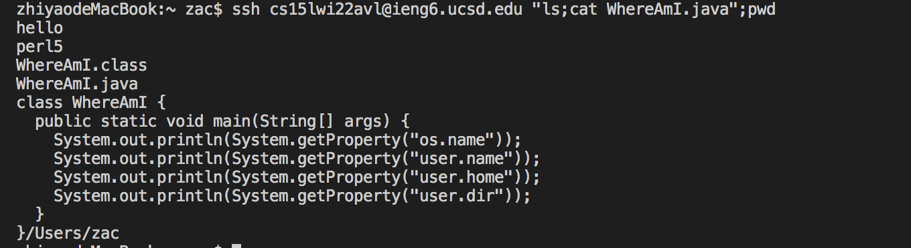

## 1.Install VScode
Go to the Visual Studio website [https://code.visualstudio.com/](https://code.visualstudio.com/). Download and install the correct version according to your operating system. 

After installing VScode, you should see a window like this:

If you see the window, congratulations! You are ready to begin the programming trial.

## 2.Connect to the remote server
Our course CSE15L uses course-specific accounts. We can use them to get on to a remote computer to do work online.

If you are on Windows, install OpenSSH. Here is the tutorial:

[Install OpenSSH](https://docs.microsoft.com/en-us/windows-server/administration/openssh/openssh_install_firstuse)

If you are on MacOS, you do not need to install anything.

Then, look up your course-specific account on:

[https://sdacs.ucsd.edu/~icc/index.php](https://sdacs.ucsd.edu/~icc/index.php)

The account should look like: `cs15lwi22***@ieng6.ucsd.edu`

Then in VScode, we can start to connect to a remote server. Use the following command, and replace the `avl` with letters in your own username.

```
$ ssh cs15lwi22avl@ieng6.ucsd.edu
```

Since this is the first time you've connected to this server, the following message is expected:

```
⤇ ssh cs15lwi22zz@ieng6.ucsd.edu
The authenticity of host 'ieng6.ucsd.edu (128.54.70.227)' can't be established.
RSA key fingerprint is SHA256:ksruYwhnYH+sySHnHAtLUHngrPEyZTDl/1x99wUQcec.
Are you sure you want to continue connecting (yes/no/[fingerprint])? 
```
For this course, type `yes` and press enter, then give your password. You should see this message:



Now your terminal is connected to a computer in the CSE basement, and any commands you run will run on that computer. Your computer is called the *client* and the computer in the basement the *server*.

PS: If you meet problems that cannot be resolved by reading this tutorial, google it.

## 3.Try some command remotely

Now you are connected to the server, try to run some commands on it.

Let's run the following commands for example:

* `cd`
* `cd ~`
* `ls`
* `ls -a`
* `ls -lat`
* `ls /home/linux/ieng6/cs15lwi22/cs15lwi22avl` (Replace `avl` with letters in your own username)
* `cp /home/linux/ieng6/cs15lwi22/public/hello.txt` (`Permission denied` message could be possible, do not worry)
* `cat hello`

The results of running these commands on my own terminal are displayed below:



To log out of the remote server, use:
* Ctrl-D
* Run the command `exit`




## 4.Move files to server with `scp`

So far we can do some work on our remote server. Next, we need to learn to copy files between the client and the server.

We will use the command line `scp`, which we always run from the client. To show how to use `scp`, create a file on your computer called `WhereAmI.java` and put the following contents into it:


```
class WhereAmI {
  public static void main(String[] args) {
    System.out.println(System.getProperty("os.name"));
    System.out.println(System.getProperty("user.name"));
    System.out.println(System.getProperty("user.home"));
    System.out.println(System.getProperty("user.dir"));
  }
}

```
Make sure this file runs properly on your own computer, then we can start to copy it to the server.

Open the terminal in the directory where you put this file, and run this command with your own username:

```
$ scp WhereAmI.java cs15lwi22avl@ieng6.ucsd.edu
```

Password is needed. Type it in and press enter. The copy process should be completed.

Now, log on to your server and use `ls` to check if you can find the file `WhereAmI.java` in the home directory. If you can, run the file with `javac` and `java` on the server.

This is how it looks when I search for and  run `WhereAmI.java` on my server:



## 5.Set an SSH key

Every time you use the command `ssh` or `scp`, you need to enter the password. It could be quite inconvenient and frustrating when you use these commands frequently.

To deal with this problem, we can use - `ssh` keys. The ssh keys require a program called `ssh-keygen`. It can create a file *public key* and a file *private key*. Copy the public key to the server, then these two files will replace the role of password when using `ssh` or `scp`. 

Below is what you should run on your computer (the *client*):

```
$ ssh-keygen
Generating public/private rsa key pair.
Enter file in which to save the key (/Users/joe/.ssh/id_rsa): /Users/joe/.ssh/id_rsa
Enter passphrase (empty for no passphrase): 
Enter same passphrase again: 
Your identification has been saved in /Users/joe/.ssh/id_rsa.
Your public key has been saved in /Users/joe/.ssh/id_rsa.pub.
The key fingerprint is:
SHA256:jZaZH6fI8E2I1D35hnvGeBePQ4ELOf2Ge+G0XknoXp0 joe@Joes-Mac-mini.local
The key's randomart image is:
+---[RSA 3072]----+
|                 |
|       . . + .   |
|      . . B o .  |
|     . . B * +.. |
|      o S = *.B. |
|       = = O.*.*+|
|        + * *.BE+|
|           +.+.o |
|             ..  |
+----[SHA256]-----+
```

In case you are on Windows, follow the tutorial here:
[https://docs.microsoft.com/en-us/windows-server/administration/openssh/openssh_keymanagement#user-key-generation](https://docs.microsoft.com/en-us/windows-server/administration/openssh/openssh_keymanagement#user-key-generation)

After creating the files, create a `.ssh` file on the server and use `scp` to copy the public key to `.ssh`:

```
$ ssh cs15lwi22zz@ieng6.ucsd.edu
<Enter Password>
# now on server
$ mkdir .ssh
$ <logout>
# back on client
$ scp /Users/joe/.ssh/id_rsa.pub cs15lwi22@ieng6.ucsd.edu:~/.ssh/authorized_keys
# You use your username and the path you saw in the command above
```

This process should look like:


As you can see now, running `ssh` no longer requires the password.

## 6.Optimize remote running

Some **tips** about using the command lines：

* Write a command in quotes at the end of an `ssh` command so that it can be carried out directly after logging into the remote server. For example, this command line logs into the remote server and shows the content of file `WhereAmI.java`:
```
$ ssh cs15lwi22avl@ieng6.ucsd.edu "cat WhereAmI.java"
```
This command line runs as below:


* Use semicolons to separate commands, so that we can carry out multiple commands on the same line.
```
$ ssh cs15lwi22avl@ieng6.ucsd.edu "ls;cat WhereAmI.java";pwd
```
This command line runs as below:


* To reuse a command line that you have typed in before, use the up arrow to access them.

