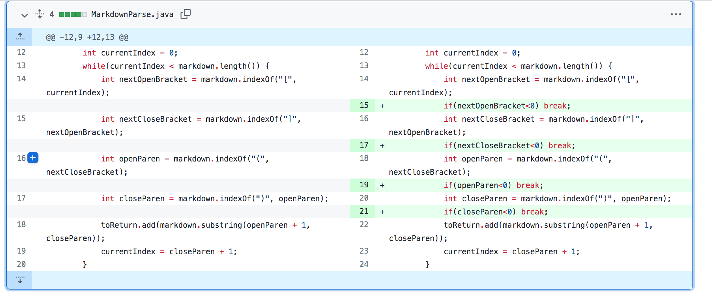
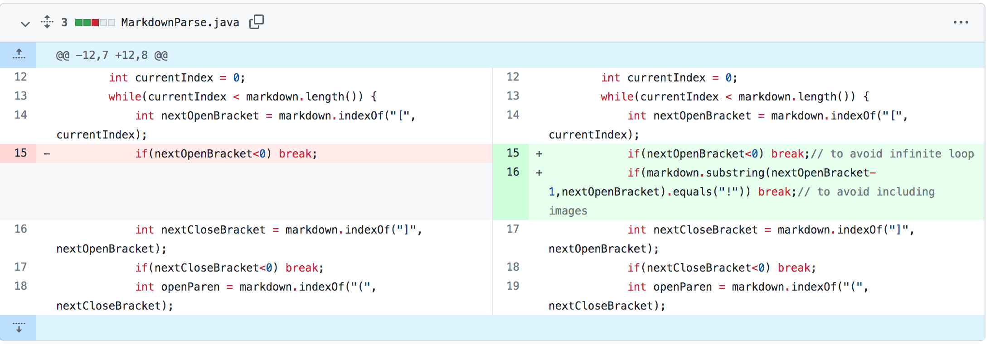
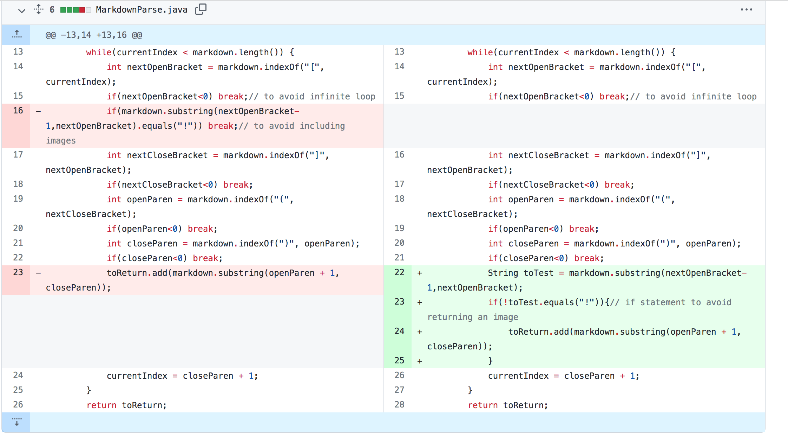

# Lab Report 2
---
## Change#1

* Code difference

* Failure inducing test file

    [test-file2.md](test-file2.md)

* Symptom

* Relation between the bug, the symptom, and the failure inducing input

## Change#2

* Code difference

 
* Failure inducing test file

    [test-file3.md](test-file3.md)

* Symptom

* Relation between the bug, the symptom, and the failure inducing input

## Change#3

* Code difference

* Failure inducing test file

    [test-file4.md](test-file4.md)

* Symptom

* Relation between the bug, the symptom, and the failure inducing input

[**Return to home page**](index.md)
