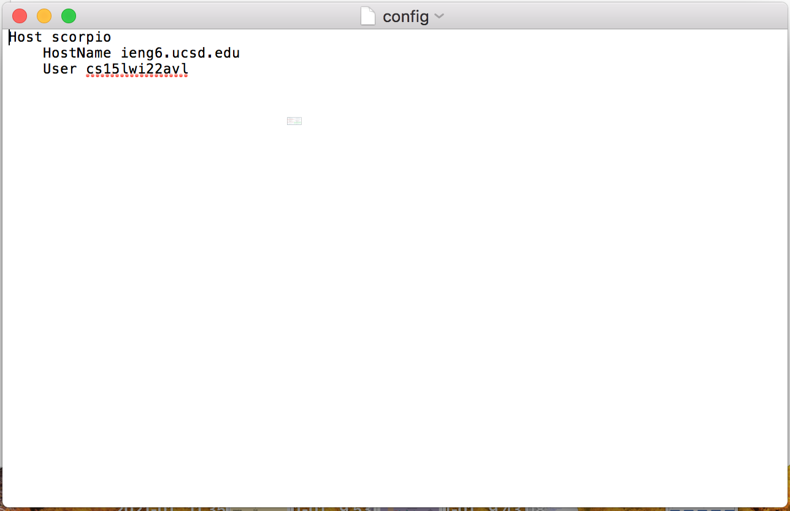
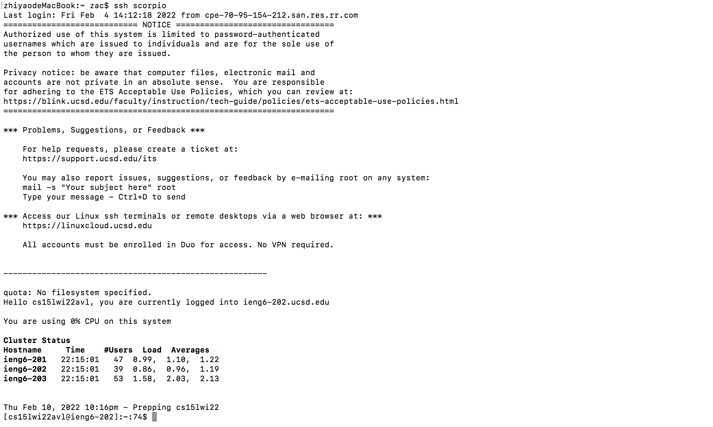
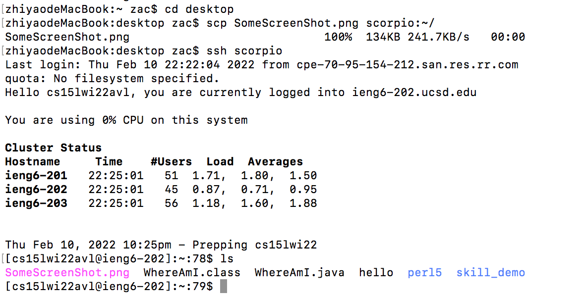

# Lab Report3
---
## 1. .ssh/config file

This file was created with command line:

`$ nano .ssh/config`

## 2. Ssh Command

Now we can log on to the server without typing the long username

## 3. Scp Command

The png file was copied to the server using the nickname scorpio

[**Return to home page**](index.md)