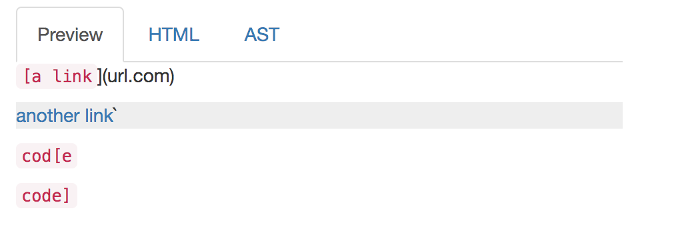
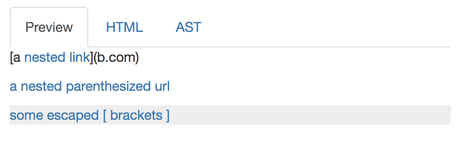
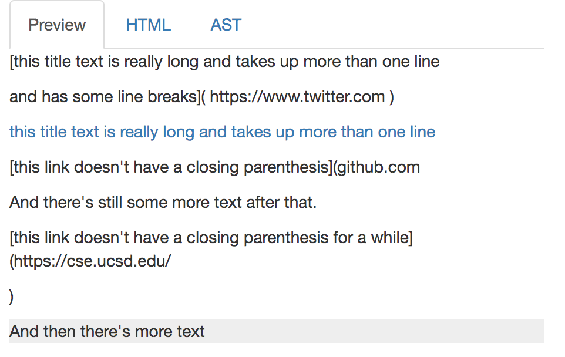

# Lab Report 4
---
## Link to reviewed file and our own file

- [reviewed markdown-parse](https://github.com/sm52/markdown-parse)

- [own markdown-parse](https://github.com/ezhou413/markdown-parse)

## Expected Production

- Snippet 1
  
  

- Snippet 2

  

- Snippet 3

  

## Added tests in `MarkdownParseTest.java`


```
    @Test
    public void testGetLinkS1() throws IOException{
        file.add("`google.com");
        String text = readFile("test-sni1.md");
        assertEquals(file, MarkdownParse.getLinks(text));
    }

    @Test
    public void testGetLinkS2() throws IOException{
        file.add("a.com");
        file.add("a.com(())");
        file.add("example.com");
        String text = readFile("test-sni2.md");
        assertEquals(file, MarkdownParse.getLinks(text));
    }

    @Test
    public void testGetLinkS3() throws IOException{
        file.add("\n    https://ucsd-cse15l-w22.github.io/\n");
        String text = readFile("test-sni3.md");
        assertEquals(file, MarkdownParse.getLinks(text));
    }
```

## Test Output

- Our implementation

```
JUnit version 4.13.2
.E.E.E
Time: 0.031
There were 3 failures:
1) testGetLinkS1(MarkdownParseTest)
java.lang.AssertionError: expected:<[`google.com, google.com, ucsd.edu]> but was:<[url.com, `google.com, google.com]>
        at org.junit.Assert.fail(Assert.java:89)
        at org.junit.Assert.failNotEquals(Assert.java:835)
        at org.junit.Assert.assertEquals(Assert.java:120)
        at org.junit.Assert.assertEquals(Assert.java:146)
        at MarkdownParseTest.testGetLinkS1(MarkdownParseTest.java:62)
2) testGetLinkS2(MarkdownParseTest)
java.lang.AssertionError: expected:<[a.com, a.com(()), example.com]> but was:<[]>
        at org.junit.Assert.fail(Assert.java:89)
        at org.junit.Assert.failNotEquals(Assert.java:835)
        at org.junit.Assert.assertEquals(Assert.java:120)
        at org.junit.Assert.assertEquals(Assert.java:146)
        at MarkdownParseTest.testGetLinkS2(MarkdownParseTest.java:71)
3) testGetLinkS3(MarkdownParseTest)
java.lang.AssertionError: expected:<[
    https://ucsd-cse15l-w22.github.io/
]> but was:<[
    https://ucsd-cse15l-w22.github.io/
, github.com

And there's still some more text after that.

[this link doesn't have a closing parenthesis for a while](https://cse.ucsd.edu/


]>
        at org.junit.Assert.fail(Assert.java:89)
        at org.junit.Assert.failNotEquals(Assert.java:835)
        at org.junit.Assert.assertEquals(Assert.java:120)
        at org.junit.Assert.assertEquals(Assert.java:146)
        at MarkdownParseTest.testGetLinkS3(MarkdownParseTest.java:78)

FAILURES!!!
Tests run: 3,  Failures: 3
```

- Reviewed implementation

```
JUnit version 4.13.2
.E.E.E
Time: 0.032
There were 3 failures:
1) testGetLinkS1(MarkdownParseTest)
java.lang.AssertionError: expected:<[`google.com, google.com, ucsd.edu]> but was:<[url.com, `google.com, google.com, ucsd.edu]>
        at org.junit.Assert.fail(Assert.java:89)
        at org.junit.Assert.failNotEquals(Assert.java:835)
        at org.junit.Assert.assertEquals(Assert.java:120)
        at org.junit.Assert.assertEquals(Assert.java:146)
        at MarkdownParseTest.testGetLinkS1(MarkdownParseTest.java:62)
2) testGetLinkS2(MarkdownParseTest)
java.lang.AssertionError: expected:<[a.com, a.com(()), example.com]> but was:<[]>
        at org.junit.Assert.fail(Assert.java:89)
        at org.junit.Assert.failNotEquals(Assert.java:835)
        at org.junit.Assert.assertEquals(Assert.java:120)
        at org.junit.Assert.assertEquals(Assert.java:146)
        at MarkdownParseTest.testGetLinkS2(MarkdownParseTest.java:71)
3) testGetLinkS3(MarkdownParseTest)
java.lang.StringIndexOutOfBoundsException: begin -2, end -1, length 452
        at java.base/java.lang.String.checkBoundsBeginEnd(String.java:3751)
        at java.base/java.lang.String.substring(String.java:1907)
        at MarkdownParse.getLinks(MarkdownParse.java:132)
        at MarkdownParseTest.testGetLinkS3(MarkdownParseTest.java:78)

FAILURES!!!
Tests run: 3,  Failures: 3
```

## Possible way to debug our implementation

### Snippet 1

We need to first check if there are ' both inside and outside the bracketed code. Then, we need to identify if the ' inside and the ' outside are paired or not by counting all the ', assign them an index, and pair them up in order. So by looking at the index of two ' , we can tell if they are a pair. If true, jump to next iteration; if false, treat this as a link and do the add.

Cannot be done by small code change.

### Snippet 2

Did not figure out how this error came out

### Snippet 3

Code below can solve first part of the problem, that the original code recognize format without close parenthesis as link.

```
int nextNextOpenBrac = markdown.indexOf("[", openParen);
                if(nextNextOpenBrac!=-1 && nextNextOpenBrac<closeParen){
                    currentIndex = nextNextOpenBrac;
                    continue;
                }
```

The second part is that a link format with close parenthesis too far away should also not be counted as a link. To solve this problem, we need to build a loop to count the new lines between last meaningful char and the close parenthesis, and set a standard for "too far".

The second part cannot be done by small code change


[**Return to home page**](index.md)

